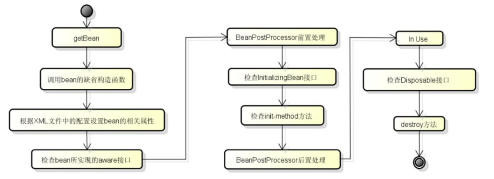

## 1 说一下IOC和AOP

IOC就是控制反转，把Bean交给Spring容器去管理，需要使用的时候就去向这个管理系统申请。

AOP是面向切面编程，使用AOP可以将把软件系统分为核心关注点和横切关注点两个部分，散落在各处和业务代码无关的代码叫做横切，比如日志、分析系统（记录运行时间和内存）等。

## 2 介绍一下 Bean 的生命周期

1. 实例化一个Bean

2. 根据Spring上下文对Bean进行配置（注入属性）

3. 如果这个Bean实现了Aware接口，就会去调用 Aware 接口的相关方法，作用是让Bean进行感知，常用的有BeanFactoryAware和ApplicationContext

4. 如果这个Bean关联了BeanPostProcessor接口，将会调用相关方法对Bean作初始化前的前置处理，经常被用作是Bean内容的更改，也可以被应用于内存或缓存技术

5. 如果Bean在Spring配置文件中配置了init-method属性会自动调用其配置的初始化方法。

6. 如果这个Bean关联了BeanPostProcessor接口，相关方法对Bean进行后置处理

7. 当Bean不再需要时，会经过清理阶段，如果Bean实现了DisposableBean这个接口，会调用那个其实现的destroy()方法；

8. 最后，如果这个Bean的Spring配置中配置了destroy-method属性，会自动调用其配置的销毁方法。

## 3 Spring 里面注解用过没有？autowired 和 resource 区别

区别：

@Autowired 是Spring提供的注解，默认按照byType注入

@Resource 默认按照 ByName 自动注入，如果找不到才会按 byType 注入

## 4 @Controller 和@RestController 的区别

@RestController 注解相当于@ResponseBody ＋ @Controller 合在一起

## 5 依赖注入的方式有几种，哪几种？

1. Set 注入 

2. 构造器注入 

3. 接口注入

## 6  Spring 中 BeanFactory 和 ApplicationContext 的区别？

BeanFactory：是原始 Factory，不支持AOP、Web这些应用，常用于Spring代码内部

ApplicationContext ：是BeanFactory子类，支持事件传递、Bean自动装配、资源访问等操作，ApplicationContext 一般对用户更加友好。

区别：ApplicationContext实例化对象是预先加载，BeanFactory是懒加载

## 7 什么是IOC和DI？DI是如何实现的？

IOC是控制反转，把控制权交给容器，由容器来创建对象并管理对象之间的依赖关系

DI是依赖注入，是实现控制反转的一种方法

## 8 Spring中Bean的作用域有哪些？

singleton、prototype、request、session、globalSession

## 9 Spring 中DAO是单例，会不会存在线程不安全问题？

不会， DAO 线程不安全是因为持有 Connection 这个非线程安全对象，不适合使用单例。但在 Spring 环境下，所有 DAO 类对可以采用单例模式，因为 Spring 利用 AOP 和  ThreadLocal 对非线程安全的对象进行了特殊处理。

## 10 谈谈 Spring 中自动装配的方式有哪些？

- no：不进行自动装配，手动设置 Bean 的依赖关系。 
- byName：根据 Bean 的名字进行自动装配。
- byType：根据 Bean 的类型进行自动装配。
- constructor：类似于 byType，不过是应用于构造器的参数，如果正好有一个 Bean 与构造器 的参数类型相同则可以自动装配，否则会导致错误。
- autodetect：如果有默认的构造器，则通过 constructor 的方式进行自动装配，否则使用 byType 的方式进行自动装配。

自动装配没有自定义装配方式那么精确，而且不能自动装配简单属性（基本类型、字符串等）， 在使用时应注意

## 11 介绍一下Spring

Spring 是一个轻量级框架，可以帮助快速构建业务应用，主要分为七个模块

1. Core Container模块，提供控制反转和依赖注入特性
2. AOP模块，提供面向切面编程
3. Messaging模块，提供消息功能
4. Data Access/Integration模块，提供数据访问和集成
5. Web模块，提供Web框架支持
6. Test模块，提供Spring测试支持
7. Instrumentation模块，提供设备支持，比如Tomcat

## 12 Spring框架的优点有哪些？

Spring可以帮助解耦代码，降低系统各个组件之间耦合

Spring是一个非侵入式框架，不需要修改类结构（例如不需要实现接口）就能对Bean进行增强

Spring支持AOP，方便对业务无关业务，例如日志等进行集中处理

Spring方便测试和框架继承

## 13 Spring 为什么需要三级缓存解决依赖循环问题

一级缓存：保存已经初始化完成的Bean

二级缓存：保存半成品Bean，属性没有被设置的Bean（属性需要依赖注入）

三级缓存：保存单例工厂，如果Bean实现了后置处理器，则这个Bean会提前放入到三级缓存，主要是生产 Bean，存放到二级缓存中

获取Bean顺序：一级->二级->三级，通过三级缓存获取的对象后，会立刻放入二级缓存

加入缓存：三级->二级->一级

不涉及AOP时，getEarlyBeanReference 返回原始Bean，

涉及AOP时，getEarlyBeanReference 返回代理Bean

[Spring 解决循环依赖必须要三级缓存吗？ - 掘金 (juejin.cn)](https://juejin.cn/post/6882266649509298189)

[Spring三级缓存解决循环依赖初认识 - 知乎 (zhihu.com)](https://zhuanlan.zhihu.com/p/455519381)

AOP不涉及依赖循环时，在实例化，赋值，初始化才创建AOP代理

AOP涉及依赖循环时，在实例化后就创建AOP代理。见下，2中B注入的A，是A的代理

A依赖B、C，B、C依赖A

1. A实例化，A进入三级缓存，A注入B时，发现B没有实例化，去实例化B
2. B实例化，B进入三级缓存，B注入A时，从三级缓存获取A，A进入二级缓存（从三级拿两次，返回的不是单例，因为拿到的新创建的代理对象），B经过完整生命周期，进入一级缓存
3. A注入C时，发现C没有实例化，去实例化C
4. C实例化，C进入三级缓存，C注入A时，从二级缓存获取A

为什么不直接在二级缓存放A的代理？还需要三级缓存？

因为会破坏A的生命周期，本来没有依赖循环的时候，应该初始化后才创建代理对象，而不是应该一开始就创建代理对象，只是因为依赖循环没办法才去创建代理对象