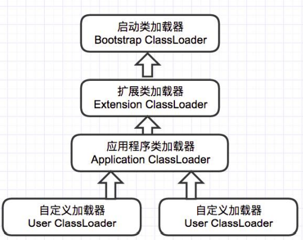
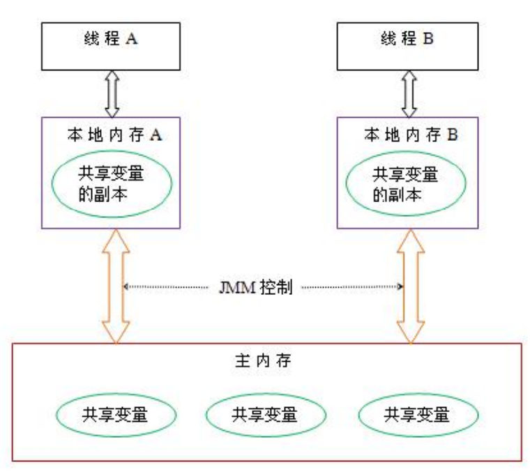

## 1 JVM 回收算法和回收器，CMS 采用哪种回收算法，怎么解决内存碎片问题?

### 垃圾回收算法

标记清除算法：标记阶段和清除阶段。

标记阶段：从根节点（静态代码块变量等，类变量）出发标记所有引用对象，未被标记的就是垃圾对象。

清除阶段：回收垃圾，回收阶段可能会存在大量空间碎片问题

复制算法：将内存区域分为两块，每次只使用一块。回收时，把存活对象复制到另一块内存区域，清除本区域对象。

标记整理算法：比复制算法更适合老年代，老年代存活对象多，复制成本高。标记整理算法是标记所有引用对象，把存活对象压缩移动到内存的一端。

### 垃圾回收器

Serial：新生代单线程收集器，会暂停用户所有进程（stop the world）

Serial Old：老年代单线程收集器

ParNew：Serial 新生代多线程版本

Parallel Scavenge：新生代多线程复制算法

CMS 收集器：老年代收集器，基于标记清除算法，分为以下四个步骤：

1. 初始标记，标记 GC roots（会 stop the world）
2. 并发标记，标记所有存活对象
3. 重新标记，扫描新生代对象+GC Roots+被标记为“脏”区的对象（新生代在 2 时晋升到老年代对象）（会 stop the world）
4. 并发清除

G1 收集器：G1 收集器管理整个 GC 堆，作用于老年代和新生代。特点是可预测的非停顿，降低垃圾收集时间。

## 2 类加载过程

JVM 类加载机制分为：加载，连接，初始化

加载：将 class 文件读入内存

连接：验证类的内部结构是否和其他类协调一致，为类变量分配内存并设置默认初始值（不是程序上的赋初始值），将对这个类的符号引用替换为直接引用（地址引用）

初始化：执行类构造器方法，也就是类变量赋值和静态代码块。

## 3 说说 JVM 类加载器

虚拟机设计团队把加载动作放到 JVM 外部实现，以便让应用程序决定如何获取所需的类，JVM 提供了 3 种类加载器：

+ 启动类加载器 (Bootstrap ClassLoader)：负责加载 JAVA_HOME\lib 目录中的，或通过 -Xbootclasspath 参数指定路径中的，且被虚拟机认可（按文件名识别，如 rt.jar）的类。

+ 扩展类加载器 (Extension ClassLoader)：负责加载 JAVA_HOME\lib\ext 目录中的，或通过 java.ext.dirs 系统变量指定路径中的类库。

+ 应用程序类加载器 (Application ClassLoader)：负责加载用户路径（classpath）上的类库。

JVM 通过双亲委派模型进行类的加载，当然我们也可以通过继承 java.lang.ClassLoader 实 现自定义的类加载器。

当一个类加载器收到类加载任务，会先交给其父类加载器去完成，因此最终加载任务都会传递到顶层的启动类加载器，只有当父类加载器无法完成加载任务时，才会尝试执行加载任务。

采用双亲委派的一个好处是比如加载位于 rt.jar 包中的类 java.lang.Object，不管是哪个加载器 加载这个类，最终都是委托给顶层的启动类加载器进行加载，这样就保证了使用不同的类加载器 最终得到的都是同样一个 Object 对象。

## 4 说说 JVM 的分区

java 内存通常被划分为 5 个区域：程序计数器（Program Count Register）、本地方法栈 （Native Stack）、方法区（Methon Area）、栈（Stack）、堆（Heap）。

## 5 说说堆区分代收集设计

目前主流的虚拟机实现都采用了分代收集的思想，把整个堆区划分为新生代和老年代；新生 代又被划分成 Eden 空间、 From Survivor 和 To Survivor 三块区域。

我们把 Eden : From Survivor : To Survivor 空间大小设成 8 : 1 : 1 ，对象总是在 Eden 区出生， From Survivor 保存当前的幸存对象， To Survivor 为空。

一次 gc 发生后：

1. Eden 区活着的对象 ＋ From Survivor 存储的对象被复制到 To Survivor ；

2) 清空 Eden 和 From Survivor ；
3)  颠倒 From Survivor 和 To Survivor 的逻辑关系： From 变 To ， To 变 From 。

只有在 Eden 空间快满的时候才会触发 Minor GC（新生代 GC） 。 而 Eden 空间占新生代的绝大部分，所以 Minor GC 的频率得以降低。当然，使用两个 Survivor 这种方式我们也付出了一定的代价，如 10% 的空间浪费、复制对象的开销等。

## 6 Java 虚拟机的作用

1. 解释执行字节码程序
2. 消除平台相关性，让 Java 程序一次编译，到处运行

## 7 GC 中如何判断对象需要被回收？

使用可达性算法从 GC Roots 出发，标记所有未使用对象，这些对象就是有可能需要被回收对象。触发 GC 后，如果这些对象没有 finalize() 方法，就会被直接回收

## 8 JAVA 虚拟机中，哪些可作为 ROOT 对象？

虚拟机栈中的引用对象

方法区中类静态属性引用的对象

方法区中常量引用对象

本地方法栈中 JNI 引用对象

## 9  JVM 内存模型是什么

Java 内存模型 (简称 JMM)，JMM 决定一个线程对共享变量的写入何时对另一个线程可见。从 抽象的角度来看，JMM 定义了线程和主内存之间的抽象关系：线程之间的共享变量存储在主内存 （main memory）中，每个线程都有一个私有的本地内存（local memory），本地内存中存储了该 线程以读/写共享变量的副本。

本地内存 (工作内存) 是 JMM 的一个抽象概念，并不真实存在。它涵盖了缓存，写缓冲区，寄存器以及其 他的硬件和编译器优化。其关系模型图如下图所示：

## 10 什么是 Java 虚拟机？为什么 Java 被称作是“平台无关的编程语言”？

Java 虚拟机是一个可以执行 Java 字节码的虚拟机进程。Java 源文件被编译成能被 Java 虚拟机执行的字节码文件。

Java 被设计成允许应用程序可以运行在任意平台，而不需要程序员为每一个平台单独重写或者是重新编译。
