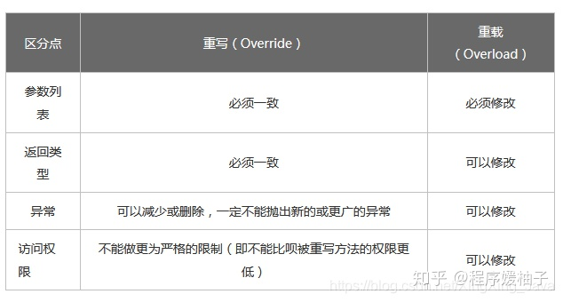
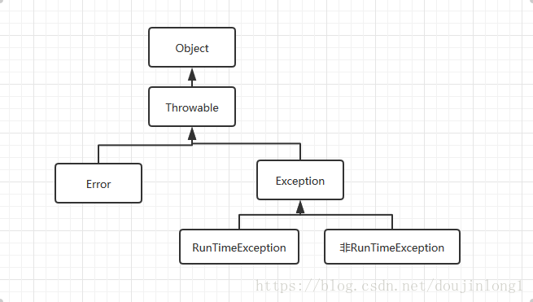

## 1 面向对象特性

抽象、封装、继承、多态

抽象：抽出共同特征

封装：对扩展开放，对修改关闭

继承：允许和鼓励类的重用

多态：指允许不同类的对象对同一消息做出响应

Java 表现为编译时多态和运行时多态。编译时多态为同名方法具有不参数，运行时多态为子类重写父类方法。

## 2 类和对象的区别

类是对一类事物的描述，是对象的集合体

对象是类的实例化

## 3 请列举你所知道的 Object 类的方法

clone() 创建并返回此对象的一个副本。需要类 implements Cloneable 接口，如果不重写 clone 方法，实现 Cloneable 仅仅起到标记作用，clone 是一个 native 方法，由 jvm 实现。

equals(Object obj) 指 示某个其他对象是否与此对象“相等”。

finalize() 当垃圾回收器确定不存在对该对象的更多引 用时，由对象的垃圾回收器调用此方法。

getClass() 返回一个对象的运行时类。

hashCode() 返回 该对象的哈希码值。

notify() 唤醒在此对象监视器上等待的单个线程。

notifyAll() 唤醒在此 对象监视器上等待的所有线程。

toString() 返回该对象的字符串表示。

wait() 导致当前的线程等待，直到其他线程调用此对象的 notify() 方法或 notifyAll() 方法。

## 4 重载和重写的区别？相同参数不同返回值能重载吗？

重载（Overloading） ：同名函数具有不同参数列表

重写（Overriding）：利用多态性，子类覆盖父类方法。需要参数列表一致、子类方法访问权限>=父类（例如子类 public，父类 protected）、返回类型为父类返回类型的派生类。

可不记扩展：

方法重写的规则

1. 参数列表与被重写方法的参数列表必须完全一致。
2. 返回类型与被重写方法的返回类型可以不相同，但是必须是父类返回值的派生类。
3. 访问权限不能比父类中被重写的方法的访问权限更低。
4. 父类的成员方法只能被它的子类重写。
5. 被 final 修饰的方法不能被重写。
6. 被 static 修饰的，即静态方法不能被重写，但是能够被再次声明。
7. 子类和父类在同一个包中，那么子类可以重写父类所有方法，除了访问权限是 private 和 被 final 修饰 的方法。
8. 子类和父类不在同一个包中，那么子类只能够重写父类的声明为 public 和 protected 的非 final 方法。
9. 重写的方法能够抛出任何非强制异常，无论被重写的方法是否抛出异常。但重写的方法不能抛出新的强制性异常，或者比被重写方法声明的更广泛的强制性异常，反之则可以。
10. 构造器不能被重写。
11. 如果不能继承一个类，则不能重写该类的方法。

## 5 ”static”关键字是什么意思？Java 中是否可以覆盖 (override) 一个 private 或者是 static 的方法？

static 表示方法或变量是静态的

static 方法不能被覆盖，因为覆盖是运行时绑定，static 方法是编译时绑定，但是 static 方法能够被再次声明。

private 方法不可以 override，因为子类不能访问父类 private 方法

## 6 StringBuffer 和 StringBuilder 有什么区别，底层实现上呢？

StringBuffer 线程安全，StringBuilder 线程不安全

底层实现上的话，StringBuffer 其 实就是比 StringBuilder 多了 Synchronized 修饰符

## 7 类加载机制，双亲委派模型，好处是什么？

特定类加载器在接到加载类的请求时，首先将加载任务委托给父类加载器，依次递归， 如果父类加载器可以完成类加载任务，就成功返回；只有父类加载器无法完成此加载任务时，才自己去加载。

使用双亲委派模型的好处在于 Java 类随着它的类加载器一起具备了一种带有优先级的层次关系，例如 Stirng 类无论在哪个类加载器加载，始终会交给最顶层 Bootstrap ClassLoader 进行加载，防止同名类由不通加载器加载造成混乱。

## 8 静态变量存放在哪？

Jdk8 以前是方法区，因为之前是用永久代来保存类信息的。

Jdk8 将这些分在元空间（直接内存）和堆中。堆里面存储了静态变量和常量。元空间存储的是类的元信息（主要是类型信息如类名、访问修饰符、字段描述、方法描述等。）

## 9 什么是泛型？

泛型，即“参数化类型”，把类型作为参数传入。

## 10 解释 extends 和 super 泛型限定符-上界不存下界不取

编译器可以支持向上转型，但不支持向下转型。

`<? extends T>`：是指 “上界通配符”，存入时，不知道如何转型（只有 T 接得住）

`<? super T>`：是指 “下界通配符”，取出时，不知道如何转型（只有 Object 接的住）

## 11 谈谈如何通过反射创建对象？

方法 1：通过类对象调用 newInstance() 方法，例如：String.class.newInstance() - 

方法 2：通过类对象的 getConstructor() 或 getDeclaredConstructor() 方法获得构造器 （Constructor）对象并调用其 newInstance() 方法创建对象，例如： String.class.getConstructor(String.class).newInstance("Hello");

## 12 Java 支持多继承吗？

不支持，但 Java 接口可以多继承，一个子接口可以有多个父接口。

## 13 接口和抽象类的区别是什么？

接口所有方法都是抽象的，抽象类可以同时包含抽象和非抽象方法。

类可以有很多个接口，但只能继承一个抽象类。

Java 接口中声明的变量默认都是 final 的。抽象类可以包含非 final 的变量。 

Java 接口中的成员函数默认是 public 的。抽象类的成员函数可以是 private，protected 或者 是 public。 

## 14 Comparable 和 Comparator 接口是干什么的？列出它们的区别

Comparable 只包含一个函数 compareTo()，用于该类内部排序

Comparator 是一个外部比较器，指导类如何排序，包含 compare() 和 equals()。

## 15 静态内部类和内部类的区别

内部类需要在外部类实例化之后才能被实例化，可以直接访问外部类成员变量

静态内部类不能访问外部类静态成员

## 16 Java 异常类

Error 是编译时错误和系统错误

Error 和 Exception 都继承自 Throwable

Exception 分为受检查异常和非运行时异常，受检查异常要求编译时通过 throws 抛出或 try-catch 处理

## 17 如何通过反射获取和设置对象私有字段的值？

可以通过类对象的 getDeclaredField() 方法字段（Field）对象，然后再通过字段对象的 setAccessible(true) 将其设置为可以访问，接下来就可以通过 get/set 方法来获取/设置字段的值了。

## 18 谈一下面向对象的"六原则一法则"

单一职责原则：一个类只做它该做的事情。

开闭原则：对扩展开放， 对修改关闭。(要加功能，派生新类)

依赖倒转原则：面向接口编程，应该使用接口而不是实体类。

里氏替换原则：任何时候都可以用子类型替换掉父类型。

合成聚合复用原则：优先使用聚合或合成关系复用代码。（就是用组合，用 Has 而不是继承）

迪米特法则：迪米特法则又叫最少知识原则，一个对象应当对其他对象有尽可能少的了解。

## 19 hashCode() 和 equals() 方法有什么联系？

Java 对象的 eqauls 方法和 hashCode 方法是这样规定的： 

➀ 相等（相同）的对象必须具有相等的哈希码（或者散列码）。

➁ 如果两个对象的 hashCode 相同，它们并不一定相同。