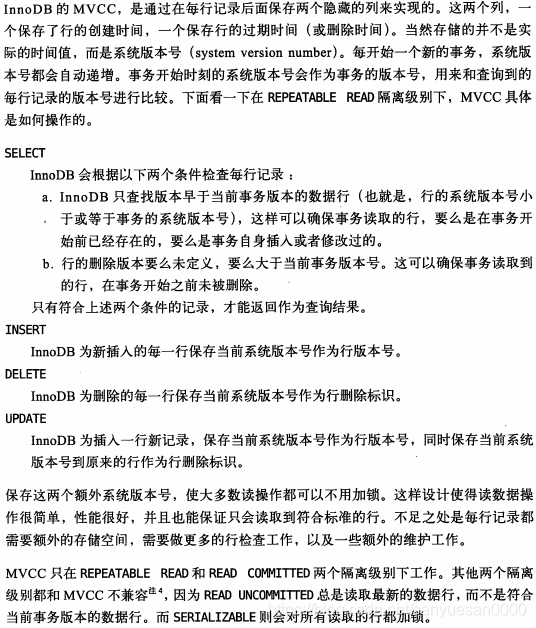

## 1 mysql 主从复制的过程

::: tip

bin log（二进制日记）：记录DDL和DML，不记录查询

relay log（中继日记）：包含待执行的语句

:::

1. 主库将数据更改斜日 bin log 日志
2. 从库通过I/O线程读取主数据库bin log日志
3. 从库通过将bin log拷贝到 relay log中
4. 从库重做 relay log，完成数据同步

## 2 怎么能解决脏读问题？

脏读问题的解决方法有：

1. 乐观锁：获取数据指定数据的版本号，修改时对版本号检查。
2. 悲观锁：每次获取数据前，都会对该数据加锁，使得任何其他线程都无法获取该数据。
3. 数据库隔离级别：使用可重复读或以上的数据库隔离级别。

## 3 redis是怎么标记失效的

Redis使用key的设置超时来标记key失效，可以用 expire 命令设置

Redis也有自己的数据淘汰策略，超过内存时触发

## 4 redis失效你怎么设计

对于热点数据，为了防止雪崩，一般不设置过期时间

选择合适的淘汰策略，可以根据过期时间、最少使用两个维度或者随机淘汰，一般是使用最少使用的进行淘汰

## 5 红黑树，b树，b+树区别

红黑树是自平衡的二叉树，b树和b+树是多叉树。

b树和b+树：b+树非叶子节点不保存数据，只保存索引，查询效率稳定，节点有指向下一节点的指针，便于范围查询。

## 6 怎么保证redis/mysql一致性（双写一致性）
最终一致性：

1. 使用事务保证双写同时成功或失败。一般先写 mysql，在写redis

2. 可以只写mysql，然后用定时任务或者监听binlog日志，让redis数据和mysql同步
3. 如果是删除可以考虑写mysql，再删redis（失败了重试）

## 7 数据库的隔离级别有哪几个？

4个：未提交读、已提交读、可重复读、可串行化

可以深读一下以下内容：

| 隔离级别 | 读脏数据 | 不可重复读 | 幻读   |
| -------- | -------- | ---------- | ------ |
| 未提交读 | 可能     | 可能       | 可能   |
| 已提交读 | 不可能   | 可能       | 可能   |
| 可重复读 | 不可能   | 不可能     | 可能   |
| 可串行化 | 不可能   | 不可能     | 不可能 |

未提交读(Read Uncommitted)：允许脏读，也就是可能**读取到其他会话中未提交事务修改的数据**。 

提交读(Read Committed)：只能读取到已经提交事务的数据。Oracle 等多数数据库默认都是该 级别 (不重复读)。 

可重复读(Repeated Read)：可重复读。在同一个事务多个实例并发查询都是事务开始时刻一致的（会看到同样的数据），InnoDB 默认级别。在 SQL 标准中，该隔离级别消除了不可重复读，但是还存在幻象读。 

串行读(Serializable)：完全串行化的读，每次读都需要获得表级共享锁，读写相互都会阻塞。

读脏数据：读到其他会话事务未提交事务的数据。【通俗：读到了别的事务回滚前的脏数据】

不可重复读【重点在update和delete，同一事务重复读同一数据就会出现问题，行锁可以解决，但解决不了insert幻读问题】：读到其他会话事务提交的数据【当前事务先进行了一次数据读取，然后再次读取到的数据是别的事务修改成功的数据，导致两次读取到的数据不匹配】

幻读【重点在insert】：事务A首先根据条件索引得到N条数据，然后事务B改变了这N条数据之外的M条或者增添了M条符合事务A搜索条件的数据，导致事务A再次搜索发现有N+M条数据了，就产生了幻读

值得注意的是mysql可重复读级别解决了幻读

MVCC多版本并发控制 

